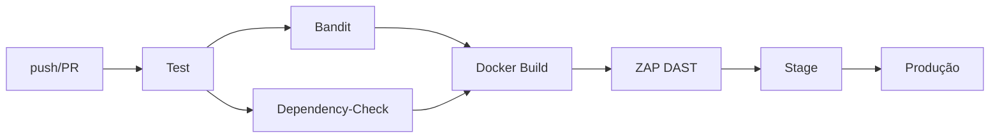

# TaskSec — Estudo de Caso DevSecOps

Sistema seguro de gerenciamento de tarefas com pipeline DevSecOps completo.

## Stack

- **App:** Python 3.12 + Flask + Gunicorn
- **Container:** python:3.12-slim + Docker Compose
- **Banco:** SQLite (via SQLAlchemy)
- **SAST:** Bandit
- **Dependency Scan:** OWASP Dependency-Check
- **DAST:** OWASP ZAP Baseline
- **CI/CD:** GitHub Actions (+ GitLab CI alternativo)
- **Log:** Syslog (syslog-ng)
- **Monitoramento:** Fail2ban

## Início Rápido

```bash
docker compose up -d --build
curl http://localhost:8080/health
```

Acessar http://localhost:8080

## Pipeline



## Etapas do Estudo de Caso

1. Planejamento e Requisitos
2. Desenvolvimento (Flask + Docker)
3. CI/CD Pipeline
4. SAST com Bandit
5. DAST com OWASP ZAP
6. Entrega Contínua
7. Monitoramento (Fail2ban + Syslog)
8. Documentação e Relatório Final

## Estrutura

```
tasksec_flask_devsecops/
├── app/                  # Código fonte Flask
├── tests/                # Testes Pytest
├── fail2ban/             # Config de monitoramento
├── .github/workflows/    # Pipeline GitHub Actions
├── docs/                 # Documentação
├── Dockerfile
├── docker-compose.yml
├── requirements.txt
└── .gitlab-ci.yml
```
